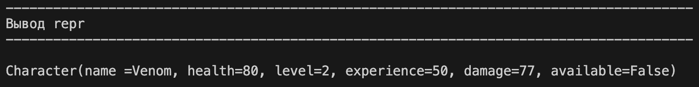
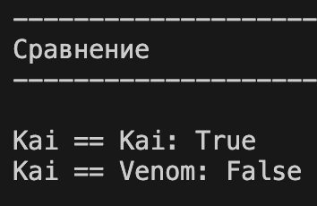
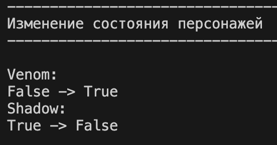
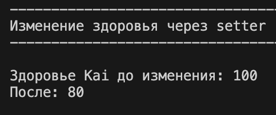
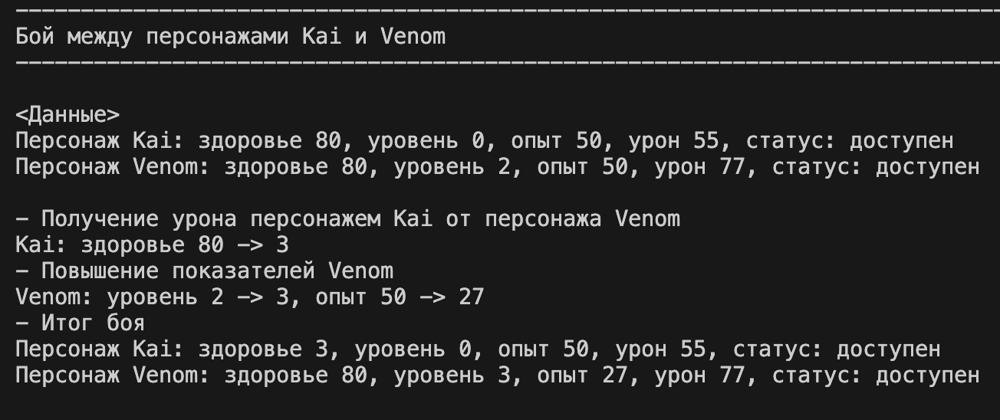
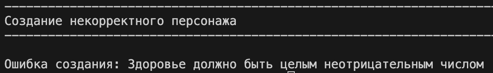

# OOP
# Описание проекта

В этом проекте представленна реализация класса **Character** на языке Python, который моделирует игрового персонажа. Класс хранит информацию об имени, здоровье, уровне, опыте, уроне и статусе доступности, а также предоставляет методы для изменения этих данных с обязательной валидацией.

Проверки вынесены в отдельный модуль `validate.py`.
В файле `demo.py` приведены несколько сценариев использования класса и демонстрация его основных возможностей.

---

# Создание класса

При разработке класса Character я руководствовалась следующими соображениями:

---

## Определение сущности «персонаж»

Необходимо было выделить ключевые характеристики игрового персонажа:

* **name** — имя персонажа (строка, не может быть пустой)
* **health** — здоровье (целое число ≥ 0)
* **level** — уровень персонажа (целое число ≥ 0)
* **experience** — опыт (целое число ≥ 0)
* **damage** — урон (целое число ≥ 0)
* **available** — доступность (булево значение, определяет, может ли персонаж участвовать в действиях)

---

## Инкапсуляция и контроль доступа

Чтобы избежать некорректного изменения данных:

* все атрибуты сделаны приватными (`_name`, `_health` и т.д.)
* доступ осуществляется через `@property`
* изменение значений проходит через setter’ы с валидацией

---

## Валидация данных

Для соблюдения принципа разделения ответственности:

* вся валидация вынесена в `validate.py`
* каждая функция отвечает за один атрибут
* при ошибке выбрасывается `ValueError`

Пример:

```python
def validate_health(value):
    if not isinstance(value, int) or value < 0:
        raise ValueError("Здоровье должно быть целым неотрицательным числом")
```

---

## Бизнес-логика

Реализованы методы, отражающие поведение персонажа:

* **take_damage()** — уменьшает здоровье
* **gain_experience()** — увеличивает опыт и повышает уровень
* **activate() / deactivate()** — изменение состояния персонажа

Методы проверяют состояние персонажа и не позволяют выполнять действия, если он деактивирован.

---

## Логическое состояние

Персонаж имеет состояние:

* `available = True` — активен
* `available = False` — недоступен

Особенности:

* при здоровье = 0 персонаж автоматически деактивируется
* недоступный персонаж не может:

  * получать урон
  * получать опыт

---

## Магические методы

Для удобства реализованы:

* ****str**** — красивый вывод персонажа
* ****repr**** — техническое представление
* ****eq**** — сравнение персонажей по характеристикам

---

## Обработка исключений

В `demo.py` показаны ситуации, где:

* вводятся некорректные данные
* выполняются запрещённые действия

Исключения выводятся пользователю.

---

# Сценарии работы программы

---

## Сценарий 1 — Создание объектов

Создаются несколько персонажей с корректными параметрами.
При создании вызываются функции валидации.

Демонстрирует:

* корректную инициализацию
* работу конструктора

Вывод в терминале:

---

## Сценарий 2 — Вывод (**str** и **repr**)

Персонажи выводятся:

* через `print()` → `__str__`
* через `repr()` → `__repr__`

Демонстрирует:

* разные форматы представления объекта

Вывод в терминале:

---

## Сценарий 3 — Сравнение объектов

```python
p1 == p4
```

Вызывает метод `__eq__`.

Персонажи считаются равными, если совпадают все их характеристики.

Вывод в терминале:

---

## Сценарий 4 — Изменение состояния

```python
p3.activate()
p2.deactivate()
```

Меняется доступность персонажей.

Демонстрирует:

* работу состояния
* влияние на поведение

Вывод в терминале:

---

## Сценарий 5 — Изменение через setter

```python
p1.health = 80
```

Вызывается:

* setter
* валидация

Демонстрирует:

* безопасное изменение данных

Вывод в терминале:

---

## Сценарий 6 — Бой персонажей

```python
battle(p1, p3)
```

Происходит:

* один персонаж получает урон
* второй получает опыт
* возможен ап уровня
* проверяется доступность

Демонстрирует:

* взаимодействие объектов
* бизнес-логику

Вывод в терминале:

---

## Сценарий 7 — Обработка ошибок

```python
Character("Bad", -30, 5, 60, 20)
```

Создаётся некорректный персонаж - ошибка.

Демонстрирует:

* работу валидации
* защиту от неверных данных

Вывод в терминале:

---

# Заключение

Данный проект демонстрирует:

* принципы ООП
* инкапсуляцию
* работу с property
* разделение логики на модули
* обработку исключений
* использование магических методов
* зависимость поведения от состояния объекта

---
