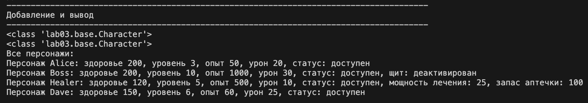
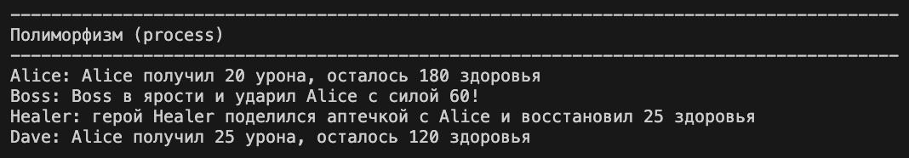
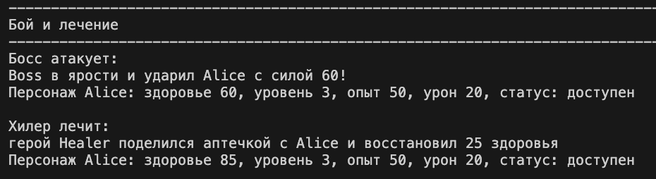
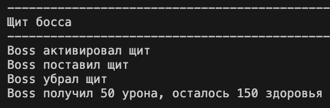
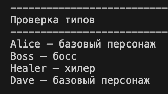
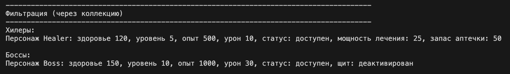
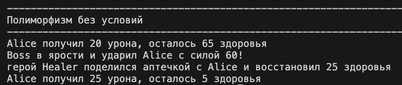

# ЛР-3

## Наследование и иерархия классов

В проекте реализована иерархия классов на основе базового класса **Character** из ЛР-1.

На его основе созданы производные классы:

* **Character_Boss**
* **Character_Healer**

Каждый дочерний класс расширяет функциональность базового класса и демонстрирует принципы наследования, переопределения методов и полиморфизма.

Файл `demo.py` содержит сценарии работы программы.

---

## Реализация иерархии классов

### Базовый класс

### Character

Базовый класс описывает игрового персонажа.

Атрибуты:

* name — имя
* health — здоровье
* level — уровень
* experience — опыт
* damage — урон
* available — статус активности

Методы:

* `take_damage()` — получение урона
* `gain_experience()` — получение опыта
* `activate()` / `deactivate()` — управление состоянием
* `process()` — базовое действие
* `__str__()` — строковое представление

---

### Дочерние классы

#### Character_Boss

Класс босса.

Дополнительные атрибуты:

* block — состояние щита
* kf_damage — коэффициент урона

Методы:

* `activate_block()`
* `deactivate_block()`
* `ultra_attack()`

Особенности:

* переопределён метод `take_damage()`
* переопределён метод `__str__()`
* реализован метод `process()` (полиморфизм)

---

#### Character_Healer

Класс хилера.

Дополнительные атрибуты:

* heal — сила лечения
* health_box — запас аптечки

Методы:

* `healing_character()`

Особенности:

* используется `property` (инкапсуляция)
* переопределён метод `__str__()`
* реализован метод `process()` (полиморфизм)

---

## Интеграция с коллекцией

Используется класс **CharacterCollection** из ЛР-2.

Коллекция:

* хранит объекты разных типов (базовый и наследники)
* поддерживает фильтрацию
* корректно работает с иерархией классов

---

## Демонстрация работы

### 1 — Создание и вывод

Создаются объекты разных типов и добавляются в коллекцию.

Демонстрируется:

* работа конструкторов
* вывод объектов через `__str__`
* итерация по коллекции


Вывод в терминале:

---

### 2 — Полиморфизм (process)

Поведение зависит от типа объекта:

* Character — базовое действие
* Character_Boss — атака
* Character_Healer — лечение

Демонстрирует:

* полиморфизм без условий (`if`)
* переопределение методов


Вывод в терминале:

---

### 3 — Взаимодействие объектов

* босс атакует персонажа
* хилер лечит персонажа

Демонстрирует:

* взаимодействие объектов разных классов
* расширение базовой логики


Вывод в терминале:

---

### 4 — Щит босса

Демонстрируется:

* активация щита
* блокировка урона
* отключение щита


Вывод в терминале:


---

### 5 — Проверка типов

Используется:

```python
isinstance()
```

Демонстрирует:

* проверку принадлежности к классу
* работу с иерархией классов


Вывод в терминале:



### 6 — Фильтрация
Фильтрация через коллекцию:

* получение только хилеров
* получение только боссов

Демонстрирует:

* работу с наследниками в одной коллекции
* выбор объектов по типу


Вывод в терминале:



Вывод демонстрации полиморфизма в терминале:



Заключение
В ходе лабораторной работы было реализовано:

* наследование классов
* переопределение методов
* использование super()
* инкапсуляция через свойства (property)
* полиморфизм через общий интерфейс process()
* работа с коллекцией объектов разных типов
* фильтрация по типу объектов