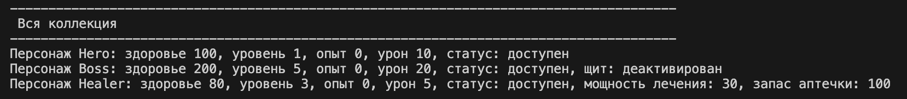

# Лабораторная работа 4

# ЛР-4

## Интерфейсы и абстрактные классы (ABC)

В проекте реализована система интерфейсов на основе абстрактных классов (**ABC**).

Добавлены контракты поведения, которые обязывают классы реализовывать определённые методы.

Используются интерфейсы:

* **Action**
* **SpecialAction**
* **Printable**

Файл `demo.py` содержит сценарии работы программы.

---

## Описание интерфейсов

### Action

Интерфейс для выполнения базового действия.

Методы:

* `process(target)` — выполнить действие над целью

---

### SpecialAction

Интерфейс для специального действия.

Методы:

* `special_process(target)` — выполнить особое действие

---

### Printable

Интерфейс для вывода объекта.

Методы:

* `to_string()` — вернуть строковое представление объекта

---

## Реализация в классах

### Character

Базовый класс реализует:

* `Action`
* `Printable`

Методы:

* `process()` — базовая атака
* `to_string()` — вывод объекта

---

### Character_Boss

Наследуется от `Character` и реализует:

* `SpecialAction`

Методы:

* `special_process()` → вызывает `ultra_attack()`

Особенности:

* использует интерфейс `Action` через наследование
* имеет усиленную атаку
* переопределяет поведение получения урона

---

### Character_Healer

Наследуется от `Character` и реализует:

* `SpecialAction`

Методы:

* `special_process()` → вызывает `healing_character()`

Особенности:

* выполняет лечение вместо атаки
* демонстрирует полиморфизм

---

## Интеграция с коллекцией

Используется класс **CharacterCollection**.

Коллекция:

* хранит объекты через интерфейс `Action`
* работает с разными типами объектов
* поддерживает фильтрацию по интерфейсам

Методы:

* `get_actions()` — получить объекты с интерфейсом Action
* `get_special_actions()` — получить объекты с интерфейсом SpecialAction
* `run_actions()` — выполнить действия через интерфейс
* `run_special_actions()` — выполнить специальные действия

---

## Демонстрация работы

### 1 — Создание и вывод

Создаются объекты разных типов и добавляются в коллекцию.

Демонстрируется:

* работа конструкторов
* вывод объектов через `__str__`
* итерация по коллекции

Вывод в терминале:  


---

### 2 — Action (интерфейс)

Все объекты вызывают метод:

```python
process()
Демонстрирует:
```

* работу через интерфейс


* единый контракт поведения


* полиморфизм без условий


Вывод в терминале:


### 3 — SpecialAction
Вызов специальных действий:
special_process()
Демонстрирует:


* разные реализации одного интерфейса


* уникальное поведение классов


* Вывод в терминале:


### 4 — Фильтрация по интерфейсам
Получение объектов:


с Action


с SpecialAction


Демонстрирует:


* работу коллекции через интерфейсы


* универсальность обработки объектов


Вывод в терминале:


### 5 — isinstance
Используется:
isinstance(obj, Action)
Демонстрирует:


* проверку реализации интерфейса


* принадлежность к контракту поведения


Вывод в терминале:


### 6 — Printable (универсальный вывод)
Используется функция:
print_all(items: list[Printable])
Демонстрирует:


* использование интерфейса как типа


* универсальный вывод объектов


* независимость от конкретных классов


Вывод в терминале:


### 7 — Реальное поведение


босс использует усиленную атаку


хилер лечит персонажа


Демонстрирует:


* взаимодействие объектов


* полиморфизм


* расширение логики через интерфейсы


Вывод в терминале:


Заключение
В ходе лабораторной работы было реализовано:


* абстрактные классы (ABC)


* интерфейсы как контракты поведения


* реализация интерфейсов в классах


* множественная реализация интерфейсов


* полиморфизм через интерфейсы


* использование интерфейсов как типов


* работа коллекции через интерфейсы


* фильтрация по интерфейсам


* универсальные функции через интерфейсы


