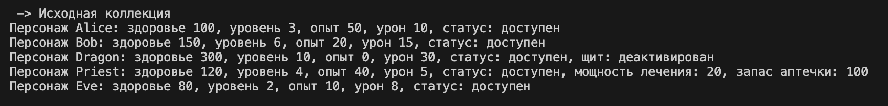
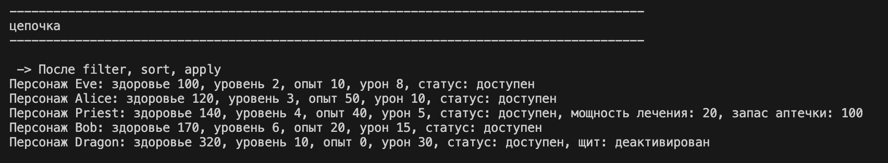
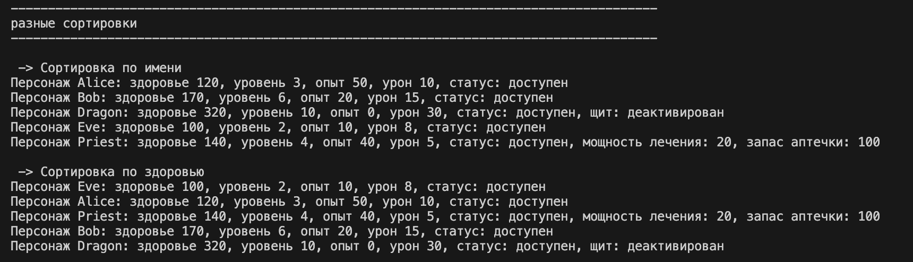
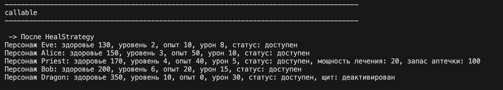
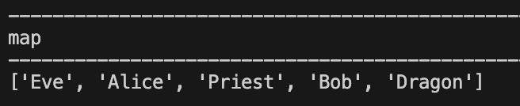
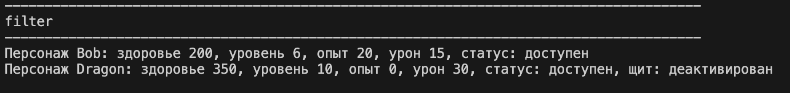
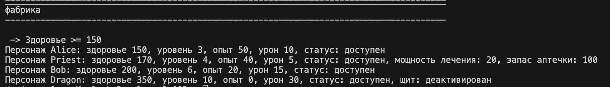

# Лабораторная работа 5

# ЛР-5

## Функции как аргументы. Стратегии и делегаты

В проекте реализована работа с функциями как объектами.

Добавлена поддержка:

* передачи функций в методы
* сортировки через функции-стратегии
* фильтрации объектов
* использования `map`, `filter`, `sorted`
* callable-объектов
* цепочек операций

Файл `demo.py` содержит примеры работы программы.

---

# Реализованные стратегии сортировки

## by_name

Сортировка персонажей по имени.

```python
collection.sort_by(by_name)
```

## by_level

Сортировка по уровню персонажа.

```python
collection.sort_by(by_level)
```

## by_health

Сортировка по здоровью персонажа.

```python
collection.sort_by(by_health)
```

# Функции-фильтры

## is_active
Фильтр активных персонажей.

```python
collection.filter_by(is_active)
```

## is_high_level
Фильтр персонажей выше 5 уровня.

```python
collection.filter_by(is_high_level)
```
## is_boss
Фильтр боссов через isinstance.
```python
isinstance(x, Character_Boss)
```

## Методы коллекции
В класс CharacterCollection добавлены методы:

## sort_by()
Сортировка объектов через переданную функцию.
Использует:

```python
sorted()
```
## filter_by()
Фильтрация объектов через функцию-предикат.

Использует:
```python
filter()
```
## apply()
Применение функции ко всем объектам коллекции.

Использует:
```python
map()
```
# Фабрика функций

Реализована функция:
```python
make_health_filter(min_health)
```
Функция создаёт новый фильтр с заданным значением здоровья.

Пример:
custom_filter = make_health_filter(150)

# Callable-объекты
Реализованы callable-классы:
* HealStrategy
* DamageBoostStrategy
* DeactivateStrategy

Используется метод:
```python
__call__()
```
Это позволяет использовать объект как функцию.
Пример:
```python
strategy = HealStrategy()
collection.apply(strategy)
```

# Демонстрация работы
## 1 — Создание коллекции
Создаются объекты разных типов и добавляются в коллекцию.

Вывод в терминале:




## 2 — Сортировка
Коллекция сортируется:
* по имени
* по уровню
* по здоровью

Вывод в терминале:



## 3 — Фильтрация
Используются разные функции-фильтры.

Вывод в терминале:




## 4 — Использование map()
Применение функции ко всем объектам.

Вывод в терминале:




## 5 — Фабрика функций
Создание фильтра с параметром.

Вывод в терминале:




## 6 — Callable-стратегии
Использование callable-объектов как стратегий.

Вывод в терминале:




## 7 — Цепочка операций
Последовательная обработка коллекции.

Вывод в терминале:




### Заключение

В ходе лабораторной работы было реализовано:


* передача функций как аргументов
* функции высшего порядка
* lambda-выражения
* использование map, filter, sorted
* функции-стратегии
* фабрики функций
* замыкания (closures)
* callable-объекты
* паттерн Стратегия
* функциональный стиль программирования
* fluent interface
* цепочки операций над коллекцией