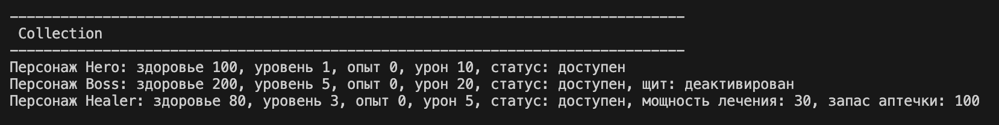
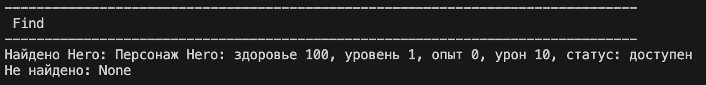
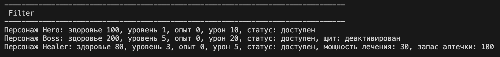
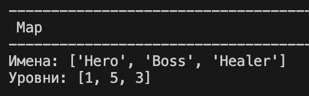
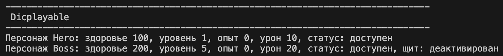
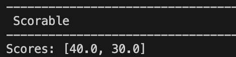

# Лабораторная работа 6

# ЛР-6

## Generics и typing

В проекте реализована система обобщённых типов (**Generic**) и структурной типизации (**Protocol**) в Python.

Добавлены:

- обобщённая коллекция `TypedCollection[T]`
- операции `find`, `filter`, `map`
- протоколы поведения `Displayable`, `Scorable`
- ограниченные типы через `TypeVar(bound=...)`

Файл `demo.py` содержит сценарии демонстрации работы системы типизации.

---

## Описание Generic-классов

### TypedCollection[T]

Обобщённая коллекция, которая может хранить объекты любого типа.

Тип параметризуется через `TypeVar`.

Методы:

- `add(item: T)` — добавить элемент
- `remove(item: T)` — удалить элемент
- `get_all() -> list[T]` — получить все элементы
- `find(predicate) -> Optional[T]` — поиск элемента
- `filter(predicate) -> list[T]` — фильтрация элементов
- `map(transform) -> list[R]` — преобразование элементов

---

## TypeVar и ограничения

Используются:

- `T` — общий тип элементов коллекции
- `R` — тип результата преобразования в `map`
- `D` — тип, ограниченный `Displayable`
- `S` — тип, ограниченный `Scorable`

---

## Описание Protocol

### Displayable

Контракт для объектов, которые могут быть отображены.

Методы:

- `display() -> str`

---

### Scorable

Контракт для объектов, которые имеют оценку.

Методы:

- `score() -> float`

---

## Особенности реализации

- классы не обязаны наследоваться от Protocol
- достаточно наличия нужных методов
- используется структурная типизация (duck typing через typing)

---

## Демонстрация работы

### 1 — Создание коллекции

Создаются коллекции разных типов:

- `TypedCollection[Character]`
- `TypedCollection[Displayable]`
- `TypedCollection[Scorable]`

Показано добавление объектов.

Вывод в терминале:

---

### 2 — find

Поиск элемента в коллекции:

- найденный элемент
- отсутствие элемента (None)

Демонстрирует:

- Optional[T]
- работу предиката

Вывод в терминале:

---

### 3 — filter

Фильтрация элементов по условию.

Демонстрирует:

- возврат нового списка
- сохранение типа T

Вывод в терминале:

---

### 4 — map (изменение типа)

Преобразование элементов:

Примеры:

- `Character -> str (имя)`
- `Character -> int (уровень)`
- `Character -> float (damage / score)`

Демонстрирует:

- изменение типа результата (R)
- работу Generic преобразований

Вывод в терминале:

---

### 5 — Displayable

Использование объектов с методом `display()`.

Демонстрирует:

- структурную типизацию
- отсутствие наследования
- проверку через поведение

Вывод в терминале:

---

### 6 — Scorable

Работа с объектами, имеющими `score()`.

Демонстрирует:

- ограничение TypeVar(bound=...)
- универсальность коллекции

Вывод в терминале:

---

## Заключение

В ходе лабораторной работы было изучено:

- обобщённые типы (Generic)
- параметризация классов через TypeVar
- структурная типизация (Protocol)
- ограниченные типы (bound)
- работа универсальных коллекций
- преобразование типов через map
- поиск и фильтрация через функции