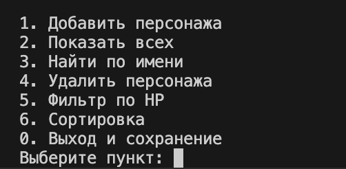
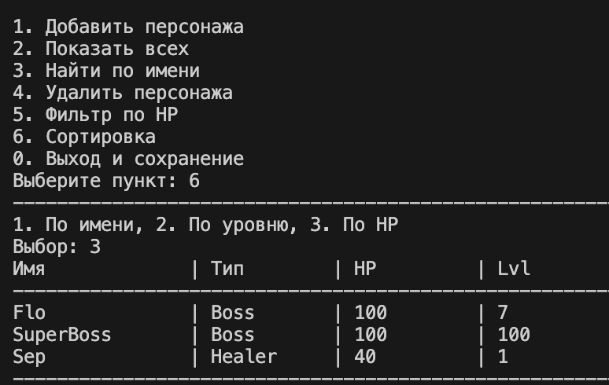

# ЛР-7

## Консольное приложение

[cite_start]В проекте реализовано полноценное интерактивное приложение с разделением на слои, объединяющее логику всех предыдущих лабораторных работ (ЛР1–ЛР6).

Добавлены:

- [cite_start]интерактивный CLI-интерфейс с системой меню
- [cite_start]автоматическое сохранение и загрузка данных через JSON
- [cite_start]разделение на слои: интерфейс (CLI), бизнес-логика (App) и хранилище (Storage)
- [cite_start]обработка собственных исключений предметной области
- [cite_start]форматированный табличный вывод данных

---

## Структура проекта

### 1. main.py
Точка входа. [cite_start]Управляет жизненным циклом: загружает данные, инициализирует CLI и сохраняет состояние перед выходом.

### 2. cli.py
Слой представления. [cite_start]Отвечает исключительно за ввод и вывод данных, меню и взаимодействие с пользователем.

### 3. app.py
Бизнес-логика. [cite_start]Управляет коллекцией объектов, выполняет поиск, фильтрацию и сортировку, не обращаясь напрямую к консоли.

### 4. storage.py
Работа с данными. [cite_start]Реализует функции `save` и `load` для сериализации объектов в формат JSON.

---

## Описание исключений

### DuplicateItemError
[cite_start]Вызывается при попытке добавить персонажа с именем, которое уже существует в коллекции.

### ItemNotFoundError
[cite_start]Вызывается при попытке удаления или поиска объекта, отсутствующего в базе.

---

## Особенности реализации

- [cite_start]**Типизация**: все методы в `app.py` и `cli.py` имеют аннотации типов согласно стандартам ЛР-6.
- [cite_start]**Валидация**: при вводе данных используются проверки из `lib.validate` (здоровье, уровень, урон).
- [cite_start]**Безопасность**: реализовано подтверждение опасных операций (удаление) через запрос `(y/n)`.
- [cite_start]**Docstrings**: все публичные методы снабжены документацией[cite: 16].

---

## Демонстрация работы

### 1 — Запуск и автозагрузка
[cite_start]При запуске программа автоматически считывает файл `data.json`, восстанавливает объекты классов `Character_Boss` и `Character_Healer` и выводит их в виде таблицы.

Вывод в терминале:

---

### 2 — Изменение и сохранение
Добавление нового объекта и удаление существующего с подтверждением. [cite_start]При выходе (пункт 0) данные сохраняются в файл.

Вывод в терминале:

---

### 3 — Сортировка по стратегии
Выбор стратегии сортировки через меню:
1. По названию
2. По уровню
3. [cite_start]По здоровью

Вывод в терминале:

---

### 4 — Фильтрация и перехват исключений
[cite_start]Фильтрация списка по условию (например, HP) и демонстрация обработки `DuplicateItemError` при попытке ввода одинаковых имен.

Вывод в терминале:

---

## Заключение

В ходе лабораторной работы было изучено:

- [cite_start]проектирование трёхслойной архитектуры приложения
- [cite_start]реализация интерактивного CLI-интерфейса
- [cite_start]работа с файловой системой и JSON-сериализацией
- [cite_start]обработка исключений и валидация пользовательского ввода
- интеграция сложной иерархии классов в единую систему управления данными