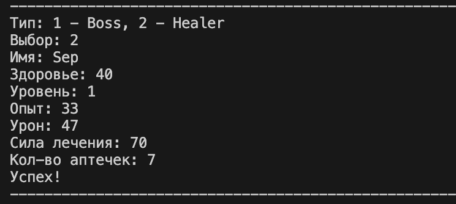
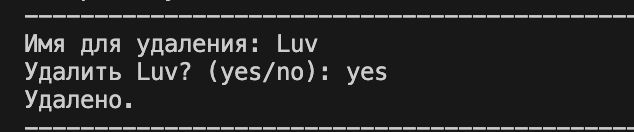
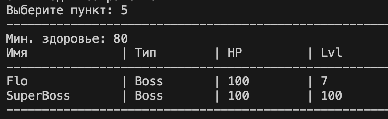
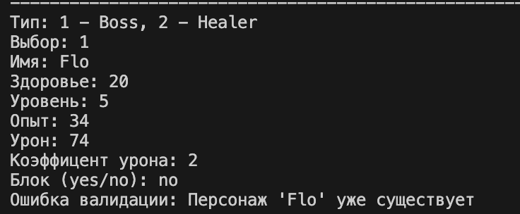

# ЛР-7

## Консольное приложение

 В проекте реализовано полноценное интерактивное приложение с разделением на слои, объединяющее логику всех предыдущих лабораторных работ (ЛР1–ЛР6).

Добавлены:

-  интерактивный CLI-интерфейс с системой меню
-  автоматическое сохранение и загрузка данных через JSON
-  разделение на слои: интерфейс (CLI), бизнес-логика (App) и хранилище (Storage)
-  обработка собственных исключений предметной области
-  форматированный табличный вывод данных

---

## Структура проекта

### 1. main.py
Точка входа.  Управляет жизненным циклом: загружает данные, инициализирует CLI и сохраняет состояние перед выходом.

### 2. cli.py
Слой представления.  Отвечает исключительно за ввод и вывод данных, меню и взаимодействие с пользователем.

### 3. app.py
Бизнес-логика.  Управляет коллекцией объектов, выполняет поиск, фильтрацию и сортировку, не обращаясь напрямую к консоли.

### 4. storage.py
Работа с данными.  Реализует функции `save` и `load` для сериализации объектов в формат JSON.

---

## Описание исключений

### DuplicateItemError
 Вызывается при попытке добавить персонажа с именем, которое уже существует в коллекции.

### ItemNotFoundError
 Вызывается при попытке удаления или поиска объекта, отсутствующего в базе.

---

## Особенности реализации

-  **Типизация**: все методы в `app.py` и `cli.py` имеют аннотации типов согласно стандартам ЛР-6.
-  **Валидация**: при вводе данных используются проверки из `lib.validate` (здоровье, уровень, урон).
-  **Безопасность**: реализовано подтверждение опасных операций (удаление) через запрос `(y/n)`.
-  **Docstrings**: все публичные методы снабжены документацией[cite: 16].

---

## Демонстрация работы

### 1 — Запуск и автозагрузка
 При запуске программа автоматически считывает файл `data.json`, восстанавливает объекты классов `Character_Boss` и `Character_Healer` и выводит список возможных действий.

Вывод в терминале:

---

### 2 — Изменение и сохранение
Добавление нового объекта и удаление существующего с подтверждением.  При выходе (пункт 0) данные сохраняются в файл.

Вывод в терминале:

---

### 3 — Сортировка по стратегии
Выбор стратегии сортировки через меню:
1. По названию
2. По уровню
3.  По здоровью

Вывод в терминале:

---

### 4 — Фильтрация и перехват исключений
 Фильтрация списка по условию и демонстрация обработки `DuplicateItemError` при попытке ввода одинаковых имен.

Вывод в терминале:

---

### Демонстрация работы

---

## Заключение

В ходе лабораторной работы было изучено:

-  проектирование трёхслойной архитектуры приложения
-  реализация интерактивного CLI-интерфейса
-  работа с файловой системой и JSON-сериализацией
-  обработка исключений и валидация пользовательского ввода
- интеграция сложной иерархии классов в единую систему управления данными